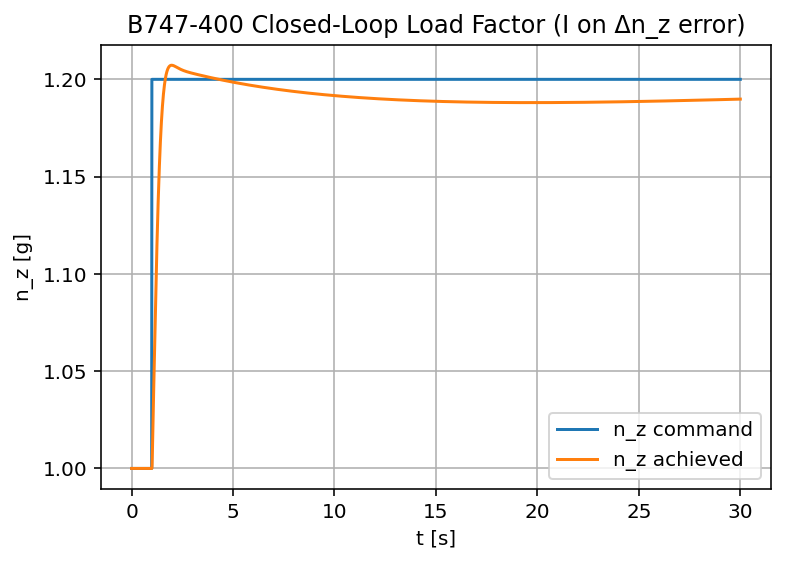
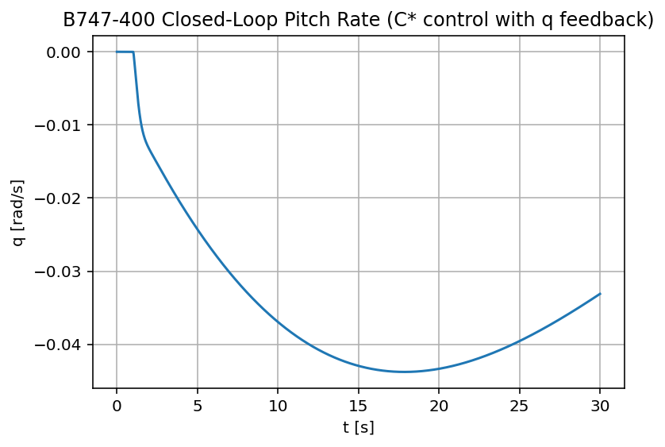
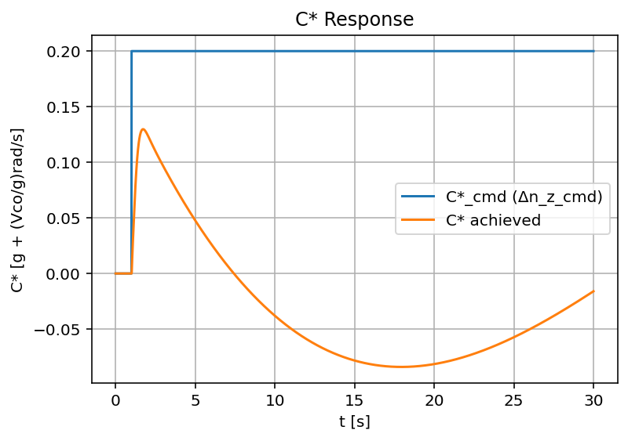
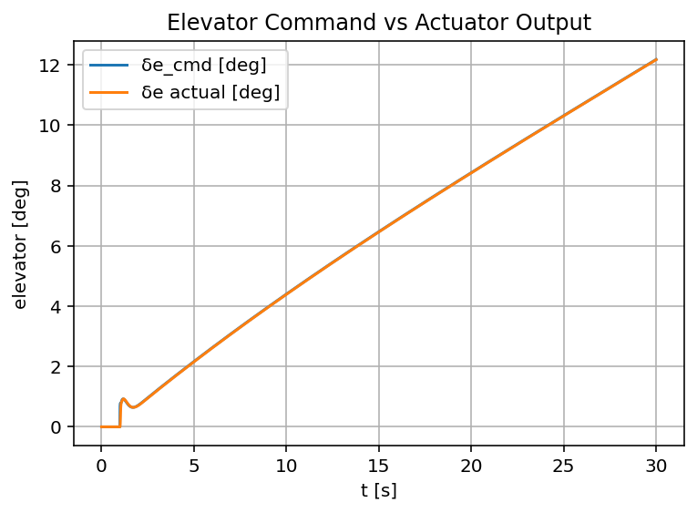
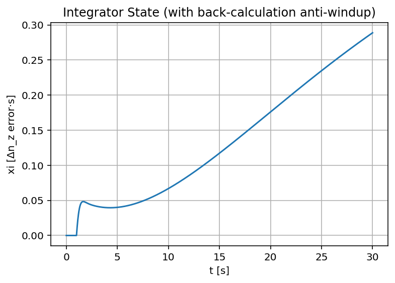

# B747-400 C* Longitudinal Flight Control Simulation

A Python-based closed-loop longitudinal flight-control simulation for a Boeing 747-400 using a classical **C\*** control architecture.

This project demonstrates how aircraft longitudinal dynamics, actuator behavior, load-factor tracking, pitch-rate feedback, washout filtering, and anti-windup logic can be combined into a compact flight-control design study.

---

## Overview

The objective of this project is to simulate closed-loop **incremental normal load-factor tracking** for a linearized Boeing 747-400 longitudinal model.

The simulation includes:

- Linearized longitudinal aircraft dynamics
- Second-order elevator actuator dynamics
- C\* handling-quality variable
- PI control for load-factor tracking
- Pitch-rate washout damping
- Elevator saturation
- Back-calculation anti-windup
- Time-domain response analysis

This project focuses on **control-system architecture and dynamic-response shaping**, rather than full nonlinear aircraft simulation or certified flight-control implementation.

---

## Key Results

For a **+0.2 g step command applied at t = 1 s**, the closed-loop system demonstrates:

- Fast load-factor response
- Small overshoot, approximately 2–3%
- Smooth settling behavior
- Stable pitch-rate dynamics
- Realistic elevator actuator motion
- Near-zero steady-state load-factor error
- Controlled integrator behavior during saturation

The C\* response shows an initial undershoot due to the pitch-rate contribution in the blended handling-quality metric. This is expected behavior for this type of control structure.

---

## System Architecture

The simulation consists of four main components:

1. **Aircraft longitudinal dynamics**
2. **Elevator actuator model**
3. **C\* control law**
4. **Closed-loop numerical simulation**

The controller generates an elevator command based on load-factor error, integral action, and pitch-rate washout feedback.

```text
Load-factor command
        |
        v
   Load-factor error ----> PI controller ----\
                                              \
                                               + ----> Elevator saturation ----> Actuator ----> Aircraft
                                              /
Pitch-rate washout --------------------------/
```

---

## Aircraft Model

The longitudinal state vector is defined as:

$$
x = [u,\; w,\; q,\; \theta]^T
$$

where:

- \(u\): forward velocity perturbation
- \(w\): vertical velocity perturbation
- \(q\): pitch rate
- \(\theta\): pitch angle

The linearized aircraft dynamics are represented in state-space form:

$$
\dot{x} = A x + B \delta_e
$$

where:

- \(A\): longitudinal aircraft dynamics matrix
- \(B\): elevator input matrix
- \(\delta_e\): elevator deflection

The small-angle approximation is used to relate vertical velocity perturbation to angle of attack:

$$
\alpha \approx \frac{w}{U_0}
$$

The \(Z_{\dot{\alpha}}\) correction is included in the heave equation to preserve more realistic short-period dynamics.

---

## Elevator Actuator Model

Elevator dynamics are modeled as a second-order actuator:

$$
\ddot{\delta}_e + 2 \zeta \omega_0 \dot{\delta}_e + \omega_0^2 \delta_e
= \omega_0^2 \delta_{e,\mathrm{cmd}}
$$

where:

- \(\delta_e\): actual elevator deflection
- \(\delta_{e,\mathrm{cmd}}\): commanded elevator deflection after saturation
- \(\zeta\): actuator damping ratio
- \(\omega_0\): actuator natural frequency

This captures actuator bandwidth, damping, and phase-lag effects.

---

## C* Handling-Quality Variable

The C\* variable combines incremental normal load factor and pitch rate:

$$
C^* = \Delta n_z + \frac{V_{co}}{g} q
$$

where:

- \(\Delta n_z\): incremental normal load factor
- \(q\): pitch rate
- \(V_{co}\): C\* blending constant
- \(g\): gravitational acceleration

This metric reflects pilot sensitivity to both acceleration response and pitch-rate motion.

---

## Control Law

The load-factor tracking error is defined as:

$$
e_{nz} = \Delta n_{z,\mathrm{cmd}} - \Delta n_z
$$

The unsaturated elevator command is computed using proportional load-factor feedback, integral action, and pitch-rate washout damping:

$$
\delta_{e,\mathrm{raw}}
=
K_p e_{nz}
+
K_i \xi
+
K_q q_{\mathrm{wash}}
$$

where:

- $K_p$: proportional load-factor gain
- $K_i$: integral gain
- $K_q$: pitch-rate washout feedback gain
- $\xi$: integrator state
- $q_{\mathrm{wash}}$: washed-out pitch-rate signal

The elevator command is then limited by actuator saturation:

$$
\delta_{e,\mathrm{cmd}}
=
\mathrm{sat}
\left(
\delta_{e,\mathrm{raw}},
\delta_{e,\min},
\delta_{e,\max}
\right)
$$

---

## Integral Action and Anti-Windup

The integrator is placed on load-factor error rather than directly on C\*. This prioritizes steady-state acceleration tracking.

Without saturation, the integrator evolves as:

$$
\dot{\xi} = e_{nz}
$$

With back-calculation anti-windup, the implemented form is:

$$
\dot{\xi}
=
e_{nz}
+
K_{aw}
\left(
\delta_{e,\mathrm{cmd}} - \delta_{e,\mathrm{raw}}
\right)
$$

where:

- \(K_{aw}\): anti-windup gain
- \(\delta_{e,\mathrm{raw}}\): unsaturated elevator command
- \(\delta_{e,\mathrm{cmd}}\): saturated elevator command

This prevents integrator runaway when the elevator command reaches actuator limits.

---

## Pitch-Rate Washout Filter

A washout filter is used to preserve pitch-rate damping while avoiding steady-state pitch-rate trim conflict.

The filter state is:

$$
\dot{q}_f = \frac{q - q_f}{T_w}
$$

The washed-out pitch-rate signal is:

$$
q_{\mathrm{wash}} = q - q_f
$$

where:

- \(q_f\): low-frequency filtered pitch-rate component
- \(T_w\): washout time constant
- \(q_{\mathrm{wash}}\): high-pass pitch-rate feedback signal

This allows the controller to react to transient pitch-rate motion while rejecting low-frequency or steady pitch-rate components.

---

## Simulation Scenario

A **+0.2 g step command** is applied at:

$$
t = 1\ \mathrm{s}
$$

The simulation is run for 30 seconds to evaluate:

- Transient load-factor response
- Pitch-rate damping
- Elevator actuator behavior
- C\* response
- Integrator behavior
- Closed-loop settling characteristics

Longer simulations may show slow bias drift because the model is linearized around a fixed trim condition and does not perform nonlinear re-trimming.

---

## Results

### Load-Factor Response



The load-factor response tracks the +0.2 g command with a fast rise time, limited overshoot, and near-zero steady-state error.

### Pitch-Rate Response



The pitch-rate response remains stable and well damped due to the washout feedback path.

### C* Response



The C\* response includes an initial undershoot caused by the pitch-rate contribution in the blended metric.

### Elevator Response



The elevator response shows actuator-limited behavior with smooth second-order dynamics.

### Integrator State



The integrator remains bounded due to the back-calculation anti-windup mechanism.

---

## Design Choices

Several control-design choices were made intentionally:

- The integrator is placed on \(\Delta n_z\), not directly on C\*, to prioritize load-factor tracking.
- Pitch-rate washout is used instead of direct pitch-rate feedback to avoid trim bias.
- Elevator saturation is included to make the simulation more realistic.
- Back-calculation anti-windup is used to prevent integrator runaway.
- Gains are tuned for moderate damping and smooth response rather than aggressive tracking.

---

## Limitations

This project is a control-system design demonstration and has several limitations:

- Linearized perturbation model only
- No nonlinear aircraft equations of motion
- No automatic re-trimming
- No gain scheduling across the flight envelope
- No atmospheric turbulence model
- No sensor noise or sensor dynamics
- Simplified actuator representation
- Not suitable for real aircraft control or certification use

---

## Project Structure

```text
b747-longitudinal-cstar-control/
│
├── src/
│   └── cstar-b747.py
│
├── figures/
│   ├── cstar_response.png
│   ├── elevator_response.png
│   ├── nz_response.png
│   ├── q_response.png
│   └── xi_response.png
│
├── requirements.txt
└── README.md
```

---

## How to Run

Clone the repository:

```bash
git clone https://github.com/hunkarsuci/b747-longitudinal-cstar-control.git
cd b747-longitudinal-cstar-control
```

Install dependencies:

```bash
pip install -r requirements.txt
```

If `requirements.txt` is not available, install the required packages manually:

```bash
pip install numpy scipy matplotlib
```

Run the simulation:

```bash
python src/cstar-b747.py
```

---

## Dependencies

The project uses:

- Python
- NumPy
- SciPy
- Matplotlib

---

## Skills Demonstrated

This project demonstrates practical knowledge of:

- Flight dynamics
- Classical control systems
- State-space modeling
- Aircraft longitudinal dynamics
- Numerical simulation
- PI control
- Anti-windup design
- Actuator modeling
- Python scientific computing
- Time-domain response analysis

---

## Disclaimer

This repository is intended for educational and portfolio purposes only.

It is not a certified flight-control system and must not be used for real aircraft operation, safety-critical control, or certification work.
