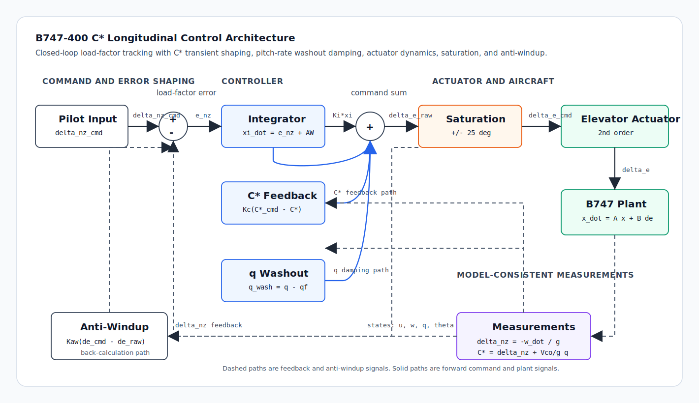
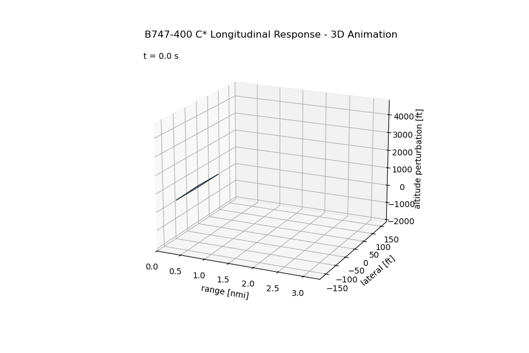

# B747-400 C* Longitudinal Flight Control Simulation

[](https://github.com/hunkarsuci/b747-longitudinal-cstar-control/actions/workflows/tests.yml)
[](LICENSE)
[](https://www.python.org/)
[](#disclaimer)

A Python closed-loop longitudinal flight-control simulation for a Boeing 747-400 using a classical **C\*** handling-quality architecture.

The project combines linearized longitudinal dynamics, elevator actuator dynamics, load-factor tracking, pitch-rate washout feedback, saturation, and back-calculation anti-windup into a compact control-design study. It also includes pytest coverage and an optional 3D response animation.

## Overview

The main scenario is incremental normal load-factor tracking for a linearized Boeing 747-400 longitudinal model. A +0.2 g command is applied at `t = 1 s`, and the simulation evaluates the closed-loop time response over 30 seconds.

Included features:

- Linearized longitudinal aircraft dynamics
- Model-consistent incremental load-factor measurement
- Second-order elevator actuator model
- C* handling-quality variable
- PI-style control with proportional C* feedback and integral load-factor tracking
- Pitch-rate washout damping
- Elevator command saturation
- Back-calculation anti-windup
- Static response plots
- Optional 3D aircraft response animation
- Automated pytest checks

## Before You Run: What C* Means

If you are new to flight-control design, **C\*** is a handling-quality signal. It is not a new aircraft state by itself. It is a blended response variable that combines what the pilot feels as vertical acceleration with what the pilot sees and senses as pitch motion.

In this project:

```text
C* = delta_nz + (Vco / g) q
```

where:

- `delta_nz` is incremental normal load factor, measured in g.
- `q` is pitch rate, measured in rad/s.
- `Vco` is a crossover or blending speed, in ft/s.
- `g` is gravitational acceleration, in ft/s^2.

The first term, `delta_nz`, represents the acceleration response. If the pilot asks for more normal acceleration, the aircraft should produce a matching load-factor change.

The second term, `(Vco / g) q`, adds pitch-rate feel. This matters because two aircraft can produce similar load factor but feel very different to a pilot if one rotates too slowly or too aggressively. C* gives the controller a way to shape both acceleration response and pitch motion together.

For learners, a useful mental model is:

```text
C* = "felt acceleration" + "pitch-rate feel"
```

This simulation commands a +0.2 g load-factor step. The controller uses C* mainly for transient handling quality, while the integrator acts on `delta_nz` error so the final load-factor value tracks the command. That split is intentional:

- C* feedback improves the short-term response and aircraft feel.
- Load-factor integral action removes steady-state acceleration error.
- Pitch-rate washout damps pitch motion without forcing a permanent pitch-rate bias.

This repository is therefore best understood as an educational control-design example: it shows how a classical aircraft handling-quality idea can be implemented, tested, plotted, and animated in Python.

## Key Results

For a +0.2 g step command, the closed-loop response is stable, bounded, and tracks the requested load-factor change with small final error. The exact metrics are printed when the simulation runs:

```bash
python src/cstar-b747.py
```

Typical checks include final load-factor error, overshoot, settling time, and maximum elevator usage. The pytest suite also guards against unbounded states and elevator command limit violations.

## System Architecture



The controller generates an elevator command using proportional C* error, integral load-factor error, direct load-factor feedback, and washed-out pitch-rate feedback.

Signal flow:

- The pilot command is a desired incremental normal load factor, `delta_nz_cmd`.
- The measured `delta_nz` is subtracted from the command to form the load-factor error.
- Integral action removes steady-state load-factor error.
- C* feedback shapes the transient response by blending load factor and pitch rate.
- Pitch-rate washout adds damping without demanding a permanent pitch-rate offset.
- Elevator saturation limits the command before it reaches the second-order actuator.
- Back-calculation anti-windup feeds the saturation difference back into the integrator.
- The aircraft plant returns model-consistent measurements used by the feedback loops.

## Aircraft Model

The longitudinal state vector is:

```text
x = [u, w, q, theta]^T
```

where:

- `u`: forward velocity perturbation
- `w`: vertical velocity perturbation
- `q`: pitch rate
- `theta`: pitch angle

The state-space model is:

```text
x_dot = A x + B delta_e
```

The small-angle relation `alpha ~= w / U0` converts angle-of-attack derivatives to `w` derivatives. The `Zalpha_dot` correction is included in the heave equation through:

```text
heave_scale = 1 / (1 - Zalpha_dot / U0)
```

## Elevator Actuator Model

Elevator dynamics are modeled as a second-order actuator:

```text
delta_e_ddot + 2*zeta*omega0*delta_e_dot + omega0^2*delta_e = omega0^2*delta_e_cmd
```

This captures finite actuator bandwidth, damping, and phase lag.

## C* Handling-Quality Variable

The C* variable combines incremental normal load factor and pitch rate:

```text
C* = delta_nz + (Vco / g) q
```

The controller uses C* for transient response shaping while integrating `delta_nz` error to remove steady-state load-factor error.

## Control Law

```text
e_c    = C*_cmd - C*
e_nz   = delta_nz_cmd - delta_nz
q_wash = q - qf

delta_e_raw = Kc*e_c + Ki*xi - kq*q_wash - knz*delta_nz
delta_e_cmd = clip(delta_e_raw, -delta_e_limit, +delta_e_limit)
```

Back-calculation anti-windup is implemented as:

```text
xi_dot = e_nz + Kaw*(delta_e_cmd - delta_e_raw)
```

The washout filter is:

```text
qf_dot = (q - qf) / Tw
q_wash = q - qf
```

## Results

### Load-Factor Response


### Pitch-Rate Response


### C* Response


### Elevator Response


### Integrator State


## 3D Animation



Show a 3D animation of the simulated longitudinal response:

```bash
python src/cstar-b747.py --animate-3d
```

Save the animation:

```bash
python src/cstar-b747.py --save-animation figures/b747_3d.gif
```

The 3D view uses the simulated pitch attitude and vertical velocity perturbation. It is a visualization aid, not a nonlinear aircraft kinematics model.

## CI Status

This repository includes a GitHub Actions CI workflow that runs `pytest` on Python 3.10, 3.11, and 3.12 for every push and pull request. The CI badge at the top of this README will show the live passing or failing status after the workflow runs on GitHub.

## Project Structure

```text
b747-longitudinal-cstar-control/
|-- .github/workflows/tests.yml
|-- figures/
|-- src/
|   |-- cstar_b747.py
|   `-- cstar-b747.py
|-- tests/
|   `-- test_cstar_b747.py
|-- pyproject.toml
|-- requirements.txt
`-- README.md
```

## How to Run

Install dependencies:

```bash
pip install -r requirements.txt
```

Run the simulation:

```bash
python src/cstar-b747.py
```

Regenerate response figures:

```bash
python src/cstar-b747.py --save-figures
```

Run tests:

```bash
pytest
```

## Design Notes

- The model is linearized around a fixed trim condition.
- Load factor is computed from the model-consistent `w_dot` equation.
- The integrator acts on incremental load-factor error rather than directly on C*.
- Pitch-rate washout keeps transient damping while reducing steady trim conflict.
- Elevator saturation and anti-windup are included so the controller behaves more realistically under limits.

## Limitations

- Linear perturbation model only
- No nonlinear six-degree-of-freedom dynamics
- No automatic re-trimming
- No gain scheduling across the flight envelope
- No atmospheric turbulence model
- No sensor noise or sensor dynamics
- Simplified actuator representation
- Not suitable for real aircraft control or certification use

## Disclaimer

This repository is intended for educational and portfolio purposes only.

It is not a certified flight-control system and must not be used for real aircraft operation, safety-critical control, or certification work.
